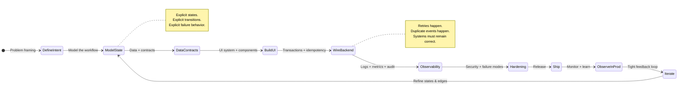

# Pako Chalebgwa

**Product Engineer** • **Software Engineer** • **UI/UX Systems Designer** • **Full-Stack Architect** • **Cat Dad** • **Visual Thinker**

I build systems where **reliability, clarity, and trust** aren’t marketing — they’re requirements.

---

## 📋 Quick Links

- [About Me](#about-me)  
- [Tech Stack](#tech-stack)  
- [Spotlight Projects](#-spotlight-projects)  
- [Featured Projects](#-featured-projects)  
- [GitHub Stats & Activity](#-github-stats--activity)  
- [Fun Extras](#-fun-extras)  
- [Connect](#-connect)  

---

## 🧑‍💻 About Me

I design and ship **high-trust product systems** end-to-end: data, UI, workflows, infra — aligned on purpose.

What I care about:
- **Deterministic workflows**: explicit state machines, predictable failure modes, clean transitions.
- **Idempotent backend flows**: retries, drops, duplicate webhooks — still correct.
- **Security + auditability**: verification, sequencing, traceability, “nothing breaks silently.”
- **UI systems with discipline**: tokens, spacing rhythm, typography hierarchy, motion cadence.
- **Cognitive-load design**: interfaces that guide decisions instead of outsourcing thinking to the user.

This isn’t hobby code.  
It’s infrastructure wearing a friendly UI.

> Software should feel inevitable — like it always wanted to work this way.

---

---

## 🧭 Operating Principles

- **State machines over vibes**: every workflow has named states, transitions, and invalid moves.
- **Idempotent by default**: retries are expected; correctness survives duplication and partial failure.
- **Observable or it didn’t happen**: logs, traces, audit trails, and metrics are first-class features.
- **Cognitive load is a bug**: UI should reduce thinking, not request it.
- **Security is a product feature**: verification, sequencing, and least-privilege everywhere.

---

## 🔧 Tech Stack

---

### Core Engineering Capabilities

- Architectures driven by **explicit state machines** (not accidental logic)
- **Idempotent** transaction and webhook flows (retries are normal, not scary)
- Secure sequencing, verification, and **audit trails** that hold up under pressure
- UI component systems built on **tokens, spacing grids, and motion cadence**
- Interfaces that **reduce cognition**, increase confidence, and prevent wrong moves
- Code that stays readable when timelines get violent

---

## ⚡ Spotlight Projects

| Project | Description | Repo Link |
|--------|-------------|----------|
| **Project Veritas** | Converts raw ideas into structured architectures and reports — turning “vibes” into execution artifacts. | https://github.com/chalebgwa/project_veritas |
| **Poseidon** | Adversarial simulation toolkit for cyber research and SOC training — designed for realistic pressure testing. | https://github.com/chalebgwa/poseidon |
| **Insight** | Recon + reporting framework for surface/internal asset visibility — built for clarity and actionability. | https://github.com/chalebgwa/insight |

---

## 🌟 Featured Projects

| Project | Description | Tech Stack | Repo Link |
|--------|-------------|------------|----------|
| **Themis** | Case + client workflow orchestration for legal operations — structured flows, clean handoffs. | Flutter | https://github.com/chalebgwa/Themis |
| **Gadget Security** | Fraud-resistant device ownership + transfer verification — identity and trust at the core. | Flutter, Firebase | https://github.com/chalebgwa/gadget-security |
| **SkeifCV** | Minimal CV builder: tight typography, clean templates, no noise. | HTML/CSS/JS | https://github.com/chalebgwa/SkeifCV |
| **Global Transparency Dashboard** | Macroeconomic + governance metrics visualization layer — signal over spectacle. | JS | https://github.com/chalebgwa/global-transparency-dashboard |

---

## 📈 GitHub Stats & Activity

---

## 🎉 Fun Extras

- **Resident Feline Supervisor**: Princess  
- Music stays on while I build  
- I sometimes build small systems just to find the hidden assumptions

---

## 📫 Connect

  
  
  

---

<picture>
  <source media="(prefers-color-scheme: dark)" srcset="https://raw.githubusercontent.com/chalebgwa/output/github-snake-dark.svg" />
  <source media="(prefers-color-scheme: light)" srcset="https://raw.githubusercontent.com/chalebgwa/output/github-snake.svg" />
  
</picture>

**System-level thinking. Precise execution. No wasted motion.**
